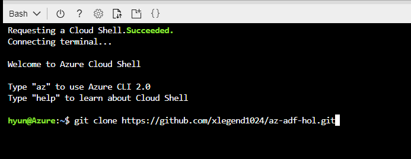

# az-adf-hol

Author: Hyun S. Shin

## Azure Data Factory hands on lab

You can run this command from cloud shell on your browser to start lab environment set up.

Chrome is recommended to copy and pate folling scripts.

Copy following command.

```cli
git clone https://github.com/xlegend1024/az-adf-hol.git
```

Paste above command to your cloud shell prompt, like following.



Run following command to change directory
```cli
cd ./az-adf-hol
```
