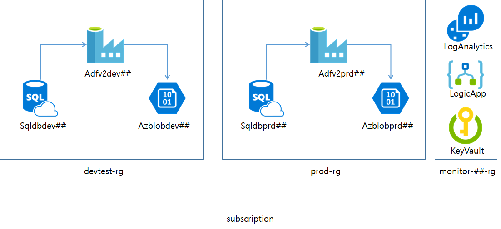

# az-adf-hol

Author: Hyun S. Shin

## Azure Data Factory hands on lab

You can run this command from cloud shell on your browser to start lab environment set up.

Chrome is recommended to copy and pate folling scripts.

## Hands-on labs architecture at the end

It will be look like following.

## Hands-on Labs Steps

1. Create Dev Environment using the script
1. Create ADF
    1. Create Pipeline to copy data from SQL DB to Blob
    1. Export Pipeline as ARM Template
1. Create Prd Environment using the script
1. Create new ADF using ARM Template
    1. Add trigger to make pipeline run every 15 minutes 
1. Create Log Analytics
    1. Enable ADF diagnotics logs to stream logs to Log Analytics in Azure Monitor
    1. Run sample Log Analytics query to see ADF activity trends
1. Create Logic App
    1. Create a propcess to send an event notification via email
1. Create Azure Key Vault 
    1. Use AKV to store SQL DB and Blob connection string safe